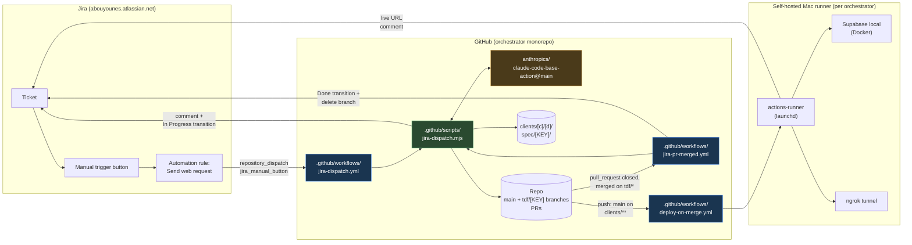
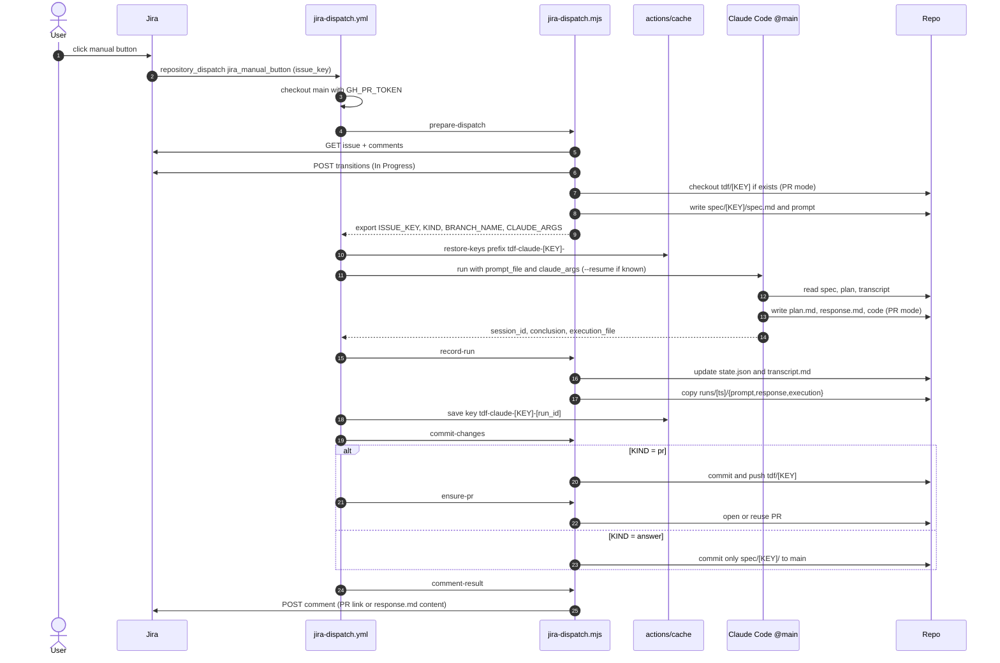
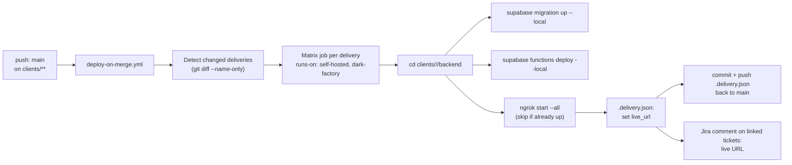
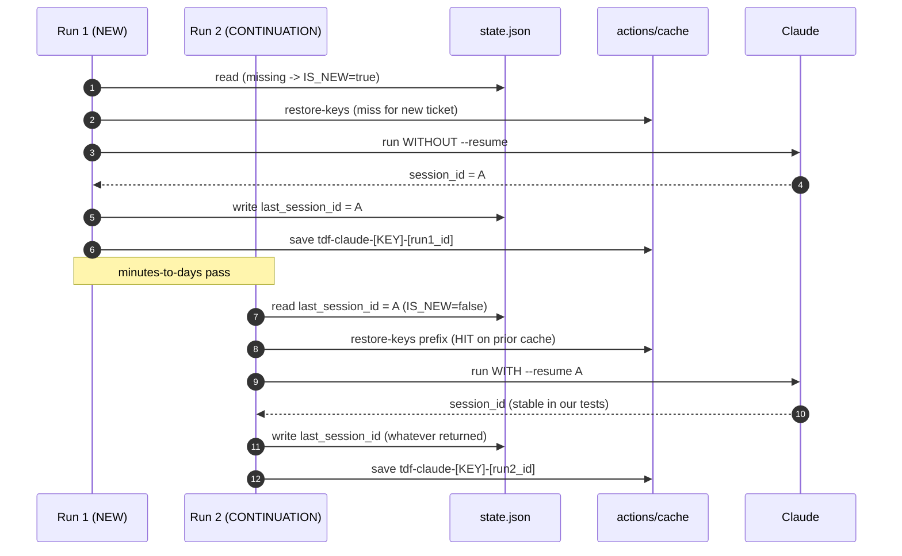

# The Dark Factory — Architecture

> Single source of truth. Read top-down for progressive depth.
>
> §0 ≤ 30 s · §1 5 min · §2 30 min · §3 120 min · §4 300 min · §5 cold-start rebuild data.

---

## §0 — Executive line

A self-driving Jira → GitHub Actions → Claude Code loop that turns every Jira ticket into either a reviewable pull request or a Jira comment, with merge-time auto-deploy to a per-client local Supabase exposed via ngrok. Zero terminal time per ticket.

---

## §1 — The 5-minute pitch

**What it is.** Press a button on a Jira ticket. A few seconds later, GitHub starts working on it. A few minutes later you have either a pull request to review or a Jira comment with the answer. Merge the PR, and the relevant client's local Supabase backend redeploys and a Jira comment posts the live URL.

**Who it is for.** Solo founders, technical product managers, and one-person teams who want a single ticket queue to drive code work, content work, and deploys without context-switching to a terminal.

**The loop.**
1. Jira ticket → manual trigger button → GitHub `repository_dispatch`.
2. GitHub workflow fetches the ticket, transitions it to "In Progress", runs Claude Code on Opus.
3. Claude either makes repository changes (PR mode) or writes a Jira-facing answer (answer mode).
4. Workflow commits, opens or updates the PR, posts a Jira comment with the result.
5. On merge, a finalize workflow transitions Jira to Done and deletes the branch. If the PR touched a `clients/<client>/<delivery>/backend/` path, the deploy workflow runs Supabase migrations on the user's Mac and (re)opens the ngrok tunnel.

**Cost shape.** ≈ $0.05–0.30 per Sonnet-driven ticket, ≈ $0.50–2 per Opus-driven ticket. GitHub Actions minutes free for personal use. ngrok free tier with random URLs, paid `$8/mo` for a reserved subdomain.

**Time shape.** Answer mode 1–3 min, small PR 3–10 min, deploy on merge 30–90 s.

**Why it works.** Session continuity across runs (cache + `state.json` + `transcript.md`) means a multi-step ticket is just multiple button presses on the same ticket; Claude resumes from where it left off.

---

## §2 — The 30-minute pitch

### System view



### Components

| Component | Role |
|---|---|
| **Jira automation rule** | "Send web request" with a hidden GitHub PAT in `Authorization: Bearer …`. Body fixed to `event_type: jira_manual_button`, `client_payload.issue_key: {{issue.key}}`. |
| **`jira-dispatch.yml`** | Listens on `repository_dispatch: jira_manual_button` (and a manual `workflow_dispatch` for testing). Fetches the ticket, runs Claude, commits, opens or updates the PR, comments back. |
| **`jira-pr-merged.yml`** | Listens on `pull_request: closed`. Filters to `merged == true && head.ref starts with 'tdf/'`. Transitions Jira to Done and deletes the branch. |
| **`deploy-on-merge.yml`** | Listens on `push: branches: [main], paths: ['clients/**']`. Runs on the self-hosted Mac runner. Detects which deliveries changed and deploys each. |
| **`jira-dispatch.mjs`** | Single helper script with seven modes: `prepare-dispatch`, `record-run`, `commit-changes`, `ensure-pr`, `comment-result`, `transition-done`, `transition-in-progress` (the last is invoked inline by `prepare-dispatch`). |
| **Self-hosted Mac runner** | One per orchestrator. Tagged `self-hosted, macos, dark-factory`. Runs as a `launchd` agent so it survives reboots. Holds the only path to localhost Supabase. |
| **Per-delivery Supabase** | `supabase start` in `clients/<c>/<d>/backend/`. One Docker stack per delivery. |
| **Per-delivery ngrok tunnel** | Exposes Supabase REST/Studio for clients/testers. Free tier random URL, paid tier reserved domain. |

### Routing rules

| Jira label | Mode |
|---|---|
| `claude:answer` (highest priority) | Answer-only. No code changes outside `clients/<c>/<d>/spec/<KEY>/`. Response posted to Jira. |
| `claude:pr` | PR mode. Claude makes minimal changes on `tdf/<key>`, workflow opens a PR. |
| `client:<slug>` | Scopes the ticket folder to `clients/<slug>/…`. |
| `delivery:<slug>` | Scopes the ticket folder to `…/<slug>/`. |

| Jira issue type | Default mode if no `claude:*` label |
|---|---|
| `Question` | Answer-only. |
| Anything else | PR mode. |

If `client:` and `delivery:` labels are missing **and** there is more than one delivery in the repo, the workflow comments back asking the user to add them and exits.

### Per-ticket artefacts

```
clients/<client>/<delivery>/spec/<TICKET-ID>/
  spec.md         Jira snapshot (refreshed every run)
  plan.md         implementation plan (Claude owns)
  response.md     Jira-facing summary or answer
  state.json      { ticket_id, kind, branch, last_session_id, prev_session_id,
                    last_run_at, last_conclusion, last_kind, run_count }
  transcript.md   one section per run (run_kind, ids, conclusion, summary)
  runs/<ts>-<id>/
    prompt.md
    response.md
    execution.json
```

For repos with no `clients/` directory yet, artefacts live at `spec/<TICKET-ID>/` directly.

### Session continuity in 60 seconds

Each run pushes a different cache key (`tdf-claude-<KEY>-<run_id>`); restoration uses a prefix (`tdf-claude-<KEY>-`) so the latest prior cache for the ticket is hydrated. After Claude runs, the workflow records the new `session_id` and saves `~/.claude/projects/`. On the next button press, `prepare-dispatch` reads `state.json.last_session_id` and, if present, passes `--resume <id>` via `claude_args`. If the cache was evicted (7-day GHA TTL), the run starts a fresh Claude session and rebuilds context from `transcript.md` — never stuck.

---

## §3 — The 120-minute pitch

### Dispatch flow, step by step



### Helper script modes (`.github/scripts/jira-dispatch.mjs`)

| Mode | Inputs (env) | Effect | Outputs (`GITHUB_ENV`) |
|---|---|---|---|
| `prepare-dispatch` | `ISSUE_KEY`, Jira creds, `GITHUB_RUN_ID` | Fetch issue, decide kind, transition to In Progress, checkout `tdf/<key>` if exists in PR mode, regenerate `spec.md`, write `prompt.md` | `KIND`, `BRANCH_NAME`, `IS_NEW`, `LAST_SESSION_ID`, `TICKET_FOLDER`, `STATE_FILE`, `TRANSCRIPT_FILE`, `SPEC_FILE`, `PLAN_FILE`, `RESPONSE_FILE`, `RUN_DIR`, `PROMPT_FILE`, `CLAUDE_ARGS`, `JIRA_ISSUE_URL`, `ISSUE_TITLE`, `SHOULD_RUN` |
| `record-run` | Action outputs (`session_id`, `conclusion`, `execution_file`) | Update `state.json`, append `transcript.md`, archive run files | `NEW_SESSION_ID` |
| `commit-changes` | `KIND`, `BRANCH_NAME`, `TICKET_FOLDER` | PR mode: `git checkout -B tdf/<key> && git add -A && git commit && git push`. Answer mode: stage `${TICKET_FOLDER}` only, commit, push to `main`. | `COMMITTED` |
| `ensure-pr` | `KIND`, `BRANCH_NAME`, `ISSUE_TITLE`, `GH_TOKEN` | If PR mode and a commit landed: open or reuse PR via REST. | `PR_URL` |
| `comment-result` | `KIND`, `RESPONSE_FILE`, Jira creds, `STATE_FILE` (for `last_conclusion` fallback) | Post `[TDF-bot]` comment on Jira with PR link (PR mode) or response.md content (answer mode). | — |
| `transition-done` | `ISSUE_KEY`, Jira creds | GET issue status, GET available transitions, POST transition matching `to.statusCategory.key === "done"` or names `Done`/`Resolved`/`Closed`. Skip if already done. Warn-and-continue on failure. | — |

### API contracts

**Jira REST v3** (auth: HTTP Basic with email + API token):

```text
GET  /rest/api/3/issue/{key}?fields=summary,description,status,...,comment&expand=renderedFields
GET  /rest/api/3/issue/{key}/transitions
POST /rest/api/3/issue/{key}/transitions       body: {"transition":{"id":"<id>"}}
POST /rest/api/3/issue/{key}/comment           body: {"body": <ADF>}
```

**GitHub REST v3** (auth: PAT with `repo` + `workflow`):

```text
GET    /repos/{owner}/{repo}/pulls?state=open&head={owner}:{branch}
POST   /repos/{owner}/{repo}/pulls             body: {"title","head","base","body"}
DELETE /repos/{owner}/{repo}/git/refs/heads/{branch}
POST   /repos/{owner}/{repo}/dispatches        body: {"event_type","client_payload":{...}}
```

**Claude Code action** — pinned to `anthropics/claude-code-base-action@main`. Inputs we use:

```yaml
with:
  claude_code_oauth_token: ${{ secrets.CLAUDE_CODE_OAUTH_TOKEN }}
  settings: |
    { "model": "opus", "effortLevel": "high" }
  prompt_file: ${{ env.PROMPT_FILE }}
  claude_args: --max-turns 60 --permission-mode bypassPermissions [--resume <id>]
```

Outputs we read: `session_id`, `conclusion`, `execution_file`.

### Gotchas (validated, see `github_actions_claude_spec.md`)

1. `@beta` of `claude-code-base-action` is too old: lacks `claude_args` and `session_id` output. Pin `@main`.
2. CI can't answer permission prompts: pass `--permission-mode bypassPermissions` via `claude_args`.
3. `git diff --quiet -- <path>` ignores untracked files. Stage with `git add -A` first, then check `git diff --cached --quiet`.
4. bash `printf` reads a leading `-` in the format as a flag. Use `printf -- '-…'`.
5. `@main` action hides assistant text from the public step log. Read it from `execution_file` JSON via `jq`.
6. `cache-hit` is `false` even when `restore-keys` matched a prior cache. Use `cache-matched-key`.
7. `actions/cache/save@v4` errors on duplicate exact keys. Always include `${{ github.run_id }}` in the save key.
8. Branch ordering: don't write files to disk before deciding whether to switch to an existing PR branch. Either move the branch checkout into `prepare-dispatch` (current solution) or split prepare into route/files phases.

### Validated POC results (2026-05-08)

- **TDS-7** (`claude:answer`): two runs. Second run resumed the same Claude session, recognized that the first run had been blocked by missing `bypassPermissions`, even referenced the fix commit by hash, then wrote the response. Jira got the answer.
- **TDS-8** (`claude:pr`): two runs. First created `tdf/tds-8`, opened PR #9. Second resumed, reused the same PR. No duplicates.
- **TDS-12** (`claude:pr`): the In-Progress transition shipped. Tickets now flip to In Progress before any code work.
- **TDS-13** (`claude:pr`): the merge-time finalizer shipped. PR #14 self-bootstrapped: its own merge transitioned TDS-13 to Done and deleted `tdf/tds-13`.
- **TDS-14** (`claude:pr`): doc-only PR refresh. `tdf/tds-14` auto-deleted within 5 seconds of merge.

### Deploy on merge — local Supabase via self-hosted Mac runner



Self-hosted runner setup (one-time, on the Mac):

```bash
# Register the runner with the orchestrator repo, then install as launchd:
./svc.sh install
./svc.sh start
# Tag in repo settings: self-hosted, macos, dark-factory
```

The runner has access to GitHub Actions secrets at job time. Local Supabase needs no secret because it's localhost — only ngrok needs `NGROK_AUTHTOKEN`.

---

## §4 — The 300-minute pitch

### State machine across runs (one ticket, multiple button presses)



### `state.json` schema

```json
{
  "ticket_id": "TDS-7",
  "kind": "pr|answer",
  "branch": "tdf/tds-7",
  "pr_url": "https://github.com/owner/repo/pull/9",
  "last_session_id": "uuid",
  "prev_session_id": "uuid|null",
  "last_run_at": "ISO 8601",
  "last_conclusion": "success|failure",
  "last_kind": "pr|answer",
  "run_count": 2
}
```

### ADF (Atlassian Document Format) snippets used

Comment with link:

```json
{
  "type": "doc", "version": 1,
  "content": [{
    "type": "paragraph",
    "content": [
      { "type": "text", "text": "Pull request: " },
      { "type": "text", "text": "https://github.com/.../pull/9",
        "marks": [{ "type": "link", "attrs": { "href": "https://github.com/.../pull/9" } }] }
    ]
  }]
}
```

Code-styled inline mark used in long-form responses:

```json
{ "type": "text", "text": ".github/scripts/jira-dispatch.mjs", "marks": [{"type":"code"}] }
```

### Failure-mode matrix

| Failure | Detection | Recovery |
|---|---|---|
| `prepare-dispatch` Jira fetch 401 | non-2xx HTTP | Step fails. User sees red ❌ on workflow. Fix: rotate `JIRA_API_TOKEN`. |
| Claude action permission prompt block | step succeeds with empty `response.md` | Already fixed: `--permission-mode bypassPermissions`. |
| Cache miss after eviction | `cache-matched-key` empty | `--resume` is omitted (`prepare-dispatch` only adds it when `LAST_SESSION_ID` is set, but cache miss alone is fine because Claude resumes from `transcript.md` context). |
| Session id rotated on resume | `prev_session_id != new_session_id` in transcript | Use the new id going forward. Stable in our tests but this is documented possible behavior. |
| Branch ordering: untracked file conflict | `git checkout` error | Already fixed: branch checkout moved into `prepare-dispatch` before any file write. |
| `commit-changes` on answer mode pushed PR-branch tip to main | wrong commit on main | Currently mitigated: answer mode checks `KIND` and never switches branches. Don't break this invariant. |
| Jira comment 4xx | non-2xx HTTP | Step fails loudly. The PR is still open; user can re-trigger. |
| `transition-done` no matching transition | no match in `transitions` API response | Warn and continue. Branch deletion still runs. |
| Branch DELETE 422 | HTTP 422 | Treated as success. |
| Self-hosted runner offline | job stays in queue | GitHub UI shows "waiting for runner". Bring the Mac online. |
| Local Supabase not running | `supabase migration up` errors | `deploy-on-merge.yml` calls `supabase status` first; if not running, `supabase start`. |
| ngrok session expired (free tier idle) | tunnel returns 404 | `deploy-on-merge.yml` (re)starts the tunnel and writes the new URL into `.delivery.json`. |

### Cost model (per ticket)

| Line item | Sonnet | Opus |
|---|---|---|
| Claude tokens (typical small PR) | $0.05–0.20 | $0.50–2.00 |
| GitHub Actions minutes (public hosted) | free tier | free tier |
| Self-hosted runner | electricity only | electricity only |
| ngrok bandwidth | free tier ≤ 2 Gbps shared | $8/mo for reserved |
| Jira Cloud | per existing seat | per existing seat |

Rough budget at 100 tickets/month on Opus: ~$50–200 in Claude costs.

### Scaling considerations

- **Concurrency per ticket**: `concurrency.group: tdf-dispatch-${ISSUE_KEY}`, `cancel-in-progress: false`. Two presses on the same ticket queue.
- **Concurrency across tickets**: GitHub Actions hosted runners handle parallelism. The self-hosted Mac runner is single-threaded by default; for >5 concurrent deploys, install `RUNNER_ALLOW_RUNASROOT=1` and run multiple instances or move to a Linux VPS.
- **Cache eviction at scale**: 10 GB per repo. Each ticket cache is small (≤ 5 MB usually). At 1000 tickets/month, monitor and prune via `gh api -X DELETE actions/caches/<id>` if needed.
- **Jira rate limits**: 10 req/s/user is comfortable. The dispatch flow makes ≤ 6 Jira calls per run.
- **GitHub rate limits**: 5000 req/h on a PAT. The dispatch flow makes ≤ 3 GitHub API calls per run.

### Security boundaries

- **Token storage**: `~/.credentials/credentials` at `0600`, no other location. Never in repo files.
- **Secret isolation**: GitHub Environments per `<client>-<delivery>` give per-delivery secret scopes (Supabase URL, ngrok auth token, etc.).
- **Workflow surface**: dispatch is `repository_dispatch` (requires `repo` scope on the PAT in Jira's webhook) — internal only, no public webhook.
- **Hidden header**: the Authorization header in Jira's "Send web request" must be marked Hidden after first successful validation.
- **Bot loop prevention**: every Jira comment prefixed `[TDF-bot]`. Future comment-driven triggers must skip those.
- **ngrok exposure**: tunneled Supabase Studio is unauthenticated by default. Either add Studio basic auth, or only expose the REST endpoint, not Studio. Document the choice in `.delivery.json`.

---

## §5 — Cold-start rebuild data

What follows is enough for any model to recreate the entire system from a cold machine. Reference material; not narrative.

### Repo skeleton

```
the-dark-factory/
├── .github/
│   ├── workflows/
│   │   ├── jira-dispatch.yml
│   │   ├── jira-pr-merged.yml
│   │   ├── deploy-on-merge.yml         (added when first delivery scaffolded)
│   │   └── poc-session.yml             (optional, kept as living POC)
│   └── scripts/
│       └── jira-dispatch.mjs
├── architecture.md                      (this file)
├── CLAUDE.md
├── README.md
├── github_actions_claude_spec.md
├── docs/
│   └── workflows.md
├── clients/
│   └── <client>/<delivery>/
│       ├── backend/                    Supabase project source
│       │   ├── supabase/
│       │   │   ├── config.toml
│       │   │   ├── migrations/
│       │   │   ├── functions/
│       │   │   └── seed.sql
│       │   └── .env.local              (gitignored)
│       ├── .delivery.json              (live_url, project_ref equivalent, owners)
│       └── spec/<TICKET-ID>/           (per-ticket artefacts)
├── benchmarks/
│   └── initial.md
├── temp/                                (ignored except for poc/)
│   └── poc/
└── .gitignore
```

### Required GitHub repo secrets (orchestrator)

| Name | Value | Used by |
|---|---|---|
| `JIRA_BASE_URL` | `https://<site>.atlassian.net` | dispatch, pr-merged |
| `JIRA_EMAIL` | account email | dispatch, pr-merged |
| `JIRA_API_TOKEN` | Atlassian API token | dispatch, pr-merged |
| `CLAUDE_CODE_OAUTH_TOKEN` | from `claude setup-token` | dispatch |
| `GH_PR_TOKEN` | classic PAT with `repo` + `workflow` (or fine-grained equiv.) | dispatch checkout, push, PR open, branch delete |
| `NGROK_AUTHTOKEN` | from ngrok dashboard | deploy-on-merge (per delivery via env if separate) |

Per-delivery via GitHub Environments (`<client>-<delivery>`):

| Name | Value |
|---|---|
| `SUPABASE_DB_PASSWORD` | local DB password (also stored in `.env.local`) |
| `NGROK_DOMAIN` | reserved subdomain or empty for random |

### Jira automation rule (one-time)

```text
Trigger: Manual trigger
Component: Send web request
URL:    https://api.github.com/repos/<owner>/<repo>/dispatches
Method: POST
Body:
  {
    "event_type": "jira_manual_button",
    "client_payload": { "issue_key": "{{issue.key}}" }
  }
Headers:
  Accept:        application/vnd.github+json
  Content-Type:  application/json
  Authorization: Bearer <GH_PR_TOKEN>     (mark Hidden after validation)
```

### Workflow files (full bodies)

#### `.github/workflows/jira-dispatch.yml`

```yaml
name: Handle Jira Manual Trigger

on:
  repository_dispatch:
    types: [jira_manual_button]
  workflow_dispatch:
    inputs:
      issue_key:
        description: "Jira issue key (e.g., TDS-7) for manual run"
        required: true

permissions:
  contents: write
  pull-requests: write

concurrency:
  group: tdf-dispatch-${{ github.event.client_payload.issue_key || github.event.inputs.issue_key }}
  cancel-in-progress: false

jobs:
  handle:
    runs-on: ubuntu-latest
    timeout-minutes: 30
    env:
      ISSUE_KEY: ${{ github.event.client_payload.issue_key || github.event.inputs.issue_key }}

    steps:
      - uses: actions/checkout@v4
        with:
          ref: main
          token: ${{ secrets.GH_PR_TOKEN }}
          fetch-depth: 0

      - name: Configure git identity
        run: |
          git config user.name "github-actions[bot]"
          git config user.email "41898282+github-actions[bot]@users.noreply.github.com"

      - name: Prepare ticket context
        env:
          GITHUB_REPOSITORY: ${{ github.repository }}
          GITHUB_RUN_ID: ${{ github.run_id }}
          JIRA_BASE_URL: ${{ secrets.JIRA_BASE_URL }}
          JIRA_EMAIL: ${{ secrets.JIRA_EMAIL }}
          JIRA_API_TOKEN: ${{ secrets.JIRA_API_TOKEN }}
        run: node .github/scripts/jira-dispatch.mjs prepare-dispatch

      - name: Restore Claude session cache
        if: env.SHOULD_RUN == 'true'
        id: cache-restore
        uses: actions/cache/restore@v4
        with:
          path: ~/.claude/projects
          key: tdf-claude-${{ env.ISSUE_KEY }}-${{ github.run_id }}
          restore-keys: |
            tdf-claude-${{ env.ISSUE_KEY }}-

      - name: Run Claude Code
        if: env.SHOULD_RUN == 'true'
        id: claude
        uses: anthropics/claude-code-base-action@main
        with:
          claude_code_oauth_token: ${{ secrets.CLAUDE_CODE_OAUTH_TOKEN }}
          settings: |
            { "model": "opus", "effortLevel": "high" }
          prompt_file: ${{ env.PROMPT_FILE }}
          claude_args: ${{ env.CLAUDE_ARGS }}

      - name: Record run outputs
        if: env.SHOULD_RUN == 'true'
        env:
          GITHUB_RUN_ID: ${{ github.run_id }}
          ACTION_SESSION_ID: ${{ steps.claude.outputs.session_id }}
          CONCLUSION: ${{ steps.claude.outputs.conclusion }}
          EXECUTION_FILE: ${{ steps.claude.outputs.execution_file }}
        run: node .github/scripts/jira-dispatch.mjs record-run

      - name: Save Claude session cache
        if: env.SHOULD_RUN == 'true' && env.NEW_SESSION_ID != ''
        uses: actions/cache/save@v4
        with:
          path: ~/.claude/projects
          key: tdf-claude-${{ env.ISSUE_KEY }}-${{ github.run_id }}

      - name: Commit changes
        if: env.SHOULD_RUN == 'true'
        env:
          GITHUB_RUN_ID: ${{ github.run_id }}
        run: node .github/scripts/jira-dispatch.mjs commit-changes

      - name: Ensure pull request (PR mode)
        if: env.SHOULD_RUN == 'true' && env.KIND == 'pr'
        env:
          GITHUB_REPOSITORY: ${{ github.repository }}
          GH_TOKEN: ${{ secrets.GH_PR_TOKEN }}
        run: node .github/scripts/jira-dispatch.mjs ensure-pr

      - name: Comment back on Jira
        if: env.SHOULD_RUN == 'true'
        env:
          GITHUB_REPOSITORY: ${{ github.repository }}
          JIRA_BASE_URL: ${{ secrets.JIRA_BASE_URL }}
          JIRA_EMAIL: ${{ secrets.JIRA_EMAIL }}
          JIRA_API_TOKEN: ${{ secrets.JIRA_API_TOKEN }}
        run: node .github/scripts/jira-dispatch.mjs comment-result
```

#### `.github/workflows/jira-pr-merged.yml`

```yaml
name: Finalize Dispatch PR

on:
  pull_request:
    types: [closed]

permissions:
  contents: write
  pull-requests: read

jobs:
  finalize:
    if: github.event.pull_request.merged == true && startsWith(github.event.pull_request.head.ref, 'tdf/')
    runs-on: ubuntu-latest
    timeout-minutes: 5
    env:
      HEAD_REF: ${{ github.event.pull_request.head.ref }}

    steps:
      - uses: actions/checkout@v4
        with: { ref: main }

      - name: Extract Jira issue key from head ref
        id: extract
        run: |
          shopt -s nocasematch
          if [[ "$HEAD_REF" =~ ^tdf/([a-z][a-z0-9]+-[0-9]+)$ ]]; then
            issue_upper=$(printf '%s' "${BASH_REMATCH[1]}" | tr '[:lower:]' '[:upper:]')
            echo "ISSUE_KEY=$issue_upper" >> "$GITHUB_ENV"
            echo "should_run=true" >> "$GITHUB_OUTPUT"
          else
            echo "should_run=false" >> "$GITHUB_OUTPUT"
          fi

      - name: Transition Jira ticket to Done
        if: steps.extract.outputs.should_run == 'true'
        env:
          JIRA_BASE_URL: ${{ secrets.JIRA_BASE_URL }}
          JIRA_EMAIL: ${{ secrets.JIRA_EMAIL }}
          JIRA_API_TOKEN: ${{ secrets.JIRA_API_TOKEN }}
        run: node .github/scripts/jira-dispatch.mjs transition-done

      - name: Delete head branch
        if: steps.extract.outputs.should_run == 'true'
        env:
          GH_TOKEN: ${{ secrets.GH_PR_TOKEN }}
          REPO: ${{ github.repository }}
          BRANCH: ${{ github.event.pull_request.head.ref }}
        run: |
          status=$(curl -sS -o /tmp/del.body -w '%{http_code}' \
            -X DELETE \
            -H "Accept: application/vnd.github+json" \
            -H "Authorization: Bearer $GH_TOKEN" \
            -H "X-GitHub-Api-Version: 2022-11-28" \
            "https://api.github.com/repos/$REPO/git/refs/heads/$BRANCH")
          case "$status" in
            200|204) echo "Deleted branch '$BRANCH' (HTTP $status)." ;;
            422)     echo "Branch '$BRANCH' already gone (HTTP 422)." ;;
            *)       echo "::warning::Failed to delete branch '$BRANCH' (HTTP $status)." ;;
          esac
```

#### `.github/workflows/deploy-on-merge.yml`

```yaml
name: Deploy on merge (local Supabase + ngrok)

on:
  push:
    branches: [main]
    paths: ["clients/**/backend/**"]

permissions:
  contents: write

jobs:
  detect:
    runs-on: ubuntu-latest
    outputs:
      deliveries: ${{ steps.detect.outputs.deliveries }}
    steps:
      - uses: actions/checkout@v4
        with: { fetch-depth: 2 }
      - id: detect
        run: |
          changed=$(git diff --name-only HEAD^ HEAD || true)
          deliveries=$(echo "$changed" \
            | awk -F/ '/^clients\/[^/]+\/[^/]+\/backend\// { print $2 "/" $3 }' \
            | sort -u | jq -R . | jq -s -c .)
          echo "deliveries=$deliveries" >> "$GITHUB_OUTPUT"

  deploy:
    needs: detect
    if: needs.detect.outputs.deliveries != '[]' && needs.detect.outputs.deliveries != ''
    runs-on: [self-hosted, dark-factory]
    strategy:
      fail-fast: false
      matrix:
        delivery: ${{ fromJSON(needs.detect.outputs.deliveries) }}
    steps:
      - uses: actions/checkout@v4
      - name: supabase up + migrate
        env:
          NGROK_AUTHTOKEN: ${{ secrets.NGROK_AUTHTOKEN }}
        run: |
          set -euo pipefail
          dir="clients/${{ matrix.delivery }}/backend"
          cd "$dir"
          supabase status >/dev/null 2>&1 || supabase start
          supabase migration up
          supabase functions deploy --no-verify-jwt || true
          # Ensure ngrok tunnel
          if ! pgrep -f "ngrok http 54321" > /dev/null; then
            nohup ngrok http 54321 --log=stdout > "$RUNNER_TEMP/ngrok-${{ matrix.delivery }}.log" 2>&1 &
            sleep 3
          fi
          live=$(curl -s http://localhost:4040/api/tunnels | jq -r '.tunnels[0].public_url')
          jq --arg url "$live" '. + {live_url:$url}' .delivery.json > .delivery.json.tmp
          mv .delivery.json.tmp .delivery.json
      - name: Commit live URL
        run: |
          git config user.name "github-actions[bot]"
          git config user.email "41898282+github-actions[bot]@users.noreply.github.com"
          git add "clients/${{ matrix.delivery }}/backend/.delivery.json"
          if ! git diff --cached --quiet; then
            git commit -m "deploy(${{ matrix.delivery }}): refresh live_url"
            git push origin HEAD:main
          fi
```

#### `.github/scripts/jira-dispatch.mjs`

> Source of truth. Reproduce by `git show main:.github/scripts/jira-dispatch.mjs`. The mode list in §3's table is exhaustive; new modes go into the `run()` switch.

### Anthropic / Claude Code OAuth token

```bash
# On any machine with claude installed:
claude setup-token
# Copies a long-lived token to clipboard. Save as CLAUDE_CODE_OAUTH_TOKEN.
```

### Self-hosted runner setup (Mac)

```bash
# In a fresh directory inside the orchestrator owner's home:
mkdir actions-runner && cd actions-runner
RUNNER_VERSION="2.319.1"
curl -O -L https://github.com/actions/runner/releases/download/v${RUNNER_VERSION}/actions-runner-osx-arm64-${RUNNER_VERSION}.tar.gz
tar xzf "./actions-runner-osx-arm64-${RUNNER_VERSION}.tar.gz"
# Get the registration token from:
#   https://github.com/<owner>/<repo>/settings/actions/runners/new
./config.sh --url https://github.com/<owner>/<repo> --token <REG_TOKEN> --labels self-hosted,macos,dark-factory
./svc.sh install
./svc.sh start
```

### Sample tickets used for smoke + benchmark

| Ticket | Labels | Purpose |
|---|---|---|
| `BOOT-1` | `claude:answer` | Answer-only smoke. Prompt: describe the dispatch flow in 3 sentences. |
| `BOOT-2` | `claude:pr` | PR-mode smoke. Prompt: add `temp/dispatch_pr_smoke.md` with a marker line. |
| `BOOT-3` | `claude:pr` | Deploy smoke. Prompt: add a trivial migration `clients/<c>/<d>/backend/supabase/migrations/<ts>_smoke.sql` containing `create table boot_smoke (id int);`. |

### Benchmark thresholds (initial)

| Metric | Target |
|---|---|
| Dispatch latency (button → workflow start) | ≤ 10 s |
| Claude run on Sonnet (small answer) | ≤ 60 s, ≤ $0.10 |
| Claude run on Opus (small PR) | ≤ 5 min, ≤ $1.00 |
| PR open latency | ≤ 5 s after Claude finishes |
| Jira comment latency | ≤ 5 s after PR open |
| Deploy on merge round-trip | ≤ 90 s on first run, ≤ 30 s on warm runs |
| ngrok URL reachability | HTTP 200 within 5 s of tunnel start |
| Session resume on second button press | same `session_id` returned |

Record these in `benchmarks/initial.md` as a baseline. Re-run quarterly.

### Operational checklist

- [ ] Mac on, runner agent up (`launchctl list | grep actions.runner`).
- [ ] Docker / Colima up (`supabase status` returns OK in the most recently deployed delivery).
- [ ] ngrok tunnel up for each delivery you expose.
- [ ] Cache size under 8 GB (`gh api repos/<owner>/<repo>/actions/cache/usage`).
- [ ] No stale `tdf/*` branches on origin (`gh api repos/<owner>/<repo>/branches`).

### How another model can rebuild this

1. Follow §5 file paths and full file bodies.
2. Resolve gotchas in §3 if the model hits them.
3. Use §3 API contracts to validate every external call.
4. Smoke against the §5 sample tickets and check the §5 benchmark thresholds.
5. If a step fails, the §4 failure-mode matrix names the recovery.

That is the system.
