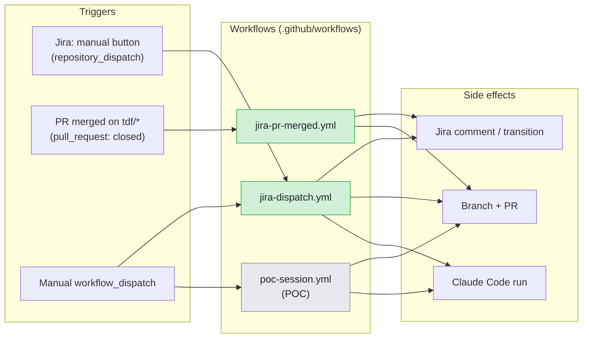
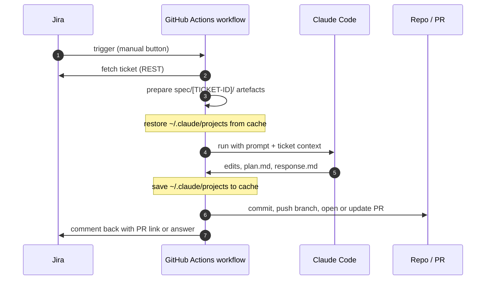

# Workflows Overview

A very high level view of how Jira tickets become repository changes in The Dark Factory.

The source of truth for behaviour is always the workflow files themselves under
[`.github/workflows/`](../.github/workflows). For a deeper spec of the dispatch
flow and Claude session continuity, see
[`../github_actions_claude_spec.md`](../github_actions_claude_spec.md).

## Workflows in this repo

| Workflow | Trigger | Purpose |
|---|---|---|
| [`jira-dispatch.yml`](../.github/workflows/jira-dispatch.yml) | `repository_dispatch: jira_manual_button` from Jira automation, or manual `workflow_dispatch` | Turn a Jira ticket into reviewable repo work or a Jira-facing answer. Resumes Claude across runs. |
| [`jira-pr-merged.yml`](../.github/workflows/jira-pr-merged.yml) | `pull_request: closed` on `tdf/<key>` branches | When a dispatch-flow PR is merged, transition the Jira ticket to Done and delete the head branch. |
| [`poc-session.yml`](../.github/workflows/poc-session.yml) | Manual `workflow_dispatch` | Proof-of-concept that Claude Code sessions can be resumed across runner invocations. |

## High level system view

Three-lane swimlane: **Triggers → Workflows → Side effects**. Trigger metadata
(`repository_dispatch`, `pull_request`, `workflow_dispatch`) is encoded in the
trigger nodes so all arrows stay unlabelled. `actions/cache` is intentionally
omitted from this view — it is an implementation detail of session continuity
and is captured in the workflow comparison table above.



## Common shape of a Jira-driven run

`jira-dispatch.yml` is the workflow that drives a ticket end-to-end.
Session-cache restore/save wraps the Claude step so progress survives
across runner invocations.



## Artefacts each run produces

```
spec/[TICKET-ID]/
  spec.md          ticket snapshot (refreshed each run)
  plan.md          implementation plan owned by Claude
  response.md      Jira-facing summary or answer
  state.json       last_session_id, run_count, kind
  transcript.md    one section per run
  runs/[ts]-[id]/  per-run prompt and response copies
```
